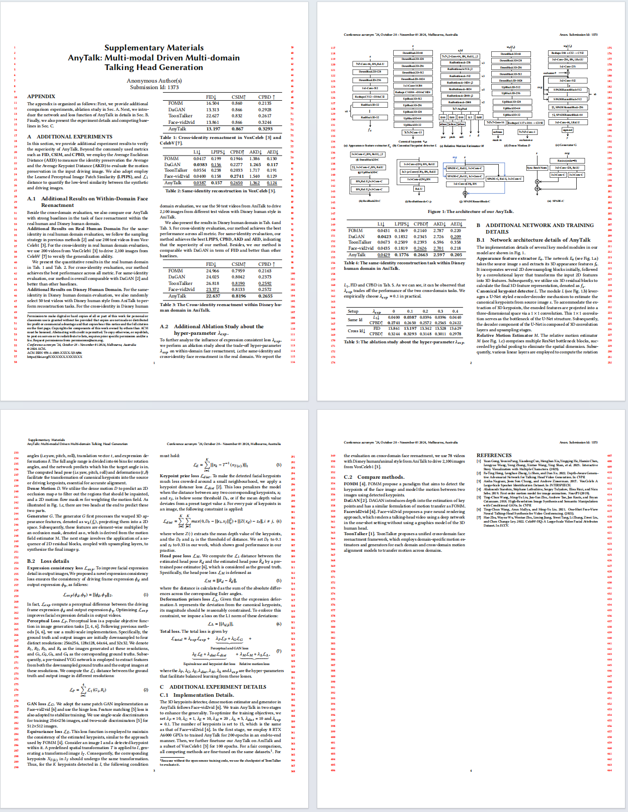

# AnyTalk: Multi-modal Driven Multi-domain Talking Head Generation

## Contributors: Anonymous

### Run
```
  bash run.sh
```

### Video Demonstration (file last updated on 18 Apr 2024)

https://github.com/anytalker/AnyTalk/assets/172362240/2b4ebc9f-7b2a-44d5-9038-5ef6c6f0f205

### Supplementary PDF ([View the complete PDF](assets/supplement_file.pdf)) (file last updated on 18 Apr 2024)
  

